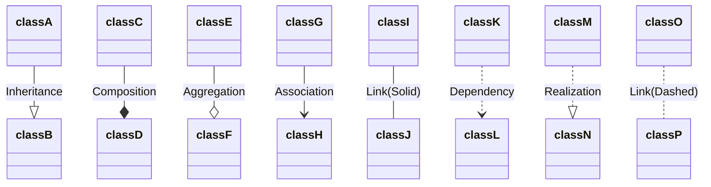
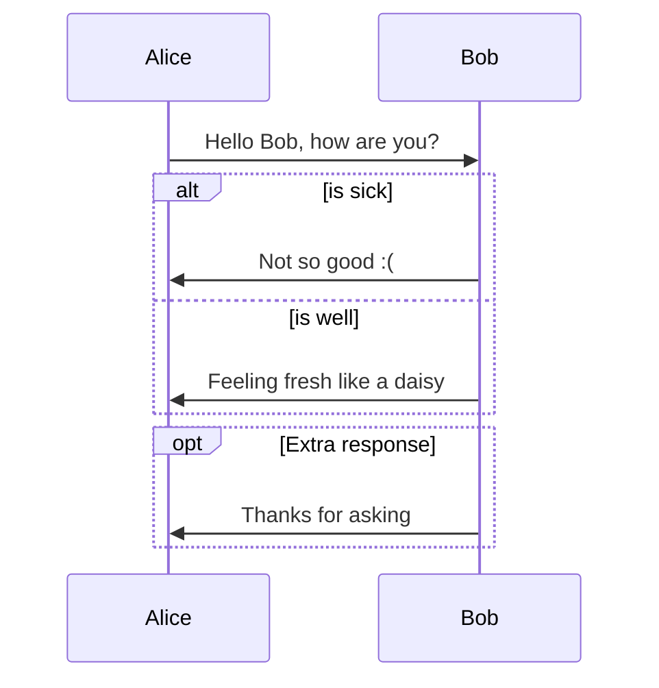

# grupp


## Userstory 003


## Userstory 004

```javascript
let a = 'Mango';

```

## Userstory 007

**bold text** *italicized text*

## Userstory 009

---

## Userstory 010

Task list:
- [x] Create repository
- [x] Clone repository
- [x] Start working with userstories
- [ ] Finish all userstories

## Userstory-011
```
> blockquote.
```
## Userstory-013


## Userstory-015
This ` word ` is highlighted 

## Userstory-016

